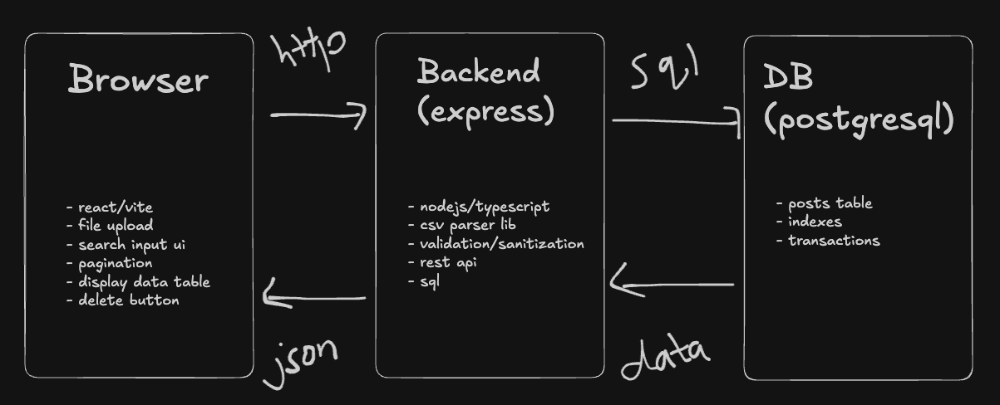

# TA140226

Simple web app demo, upload csv then show data on table w/ pagination

## Architecture



## Tech Stack

- **Frontend**: react+vite/ts
- **UI/Style**: tailwind css
- **Backend**: node/express/ts
- **Database**: postgresql
- **Testing**: vitest + react testing library
- **Containerization**: docker

## Setup Instructions

### Prerequisites

- **Node.js**
- **Docker**
- **Git**

### Option 1: via Docker

1. **Clone repo**
   ```bash
   git clone <put repo url here>
   cd ta-140226
   ```

2. **Cmd to start all services**
   ```bash
   docker-compose up
   ```

   **Note**: initial run might take awhile because need to build the images, subsequent runs should be faster

   This will start the following services on the respective ports, unless otherwise changed
   - postgresql on port 5432
   - backend on port 3001
   - frontend on port 5173

3. **To use the web app**
   - Navigate to http://localhost:5173

4. **To stop**
   ```bash
   docker-compose down
   ```

### Option 2: Run locally

#### 1. Start postgresql with Docker

```bash
docker-compose up postgres
```

#### 2. Next start the backend

```bash
cd backend
npm install
npm run dev
```

#### 3. Lastly the frontend

Open a new terminal:

```bash
cd frontend
npm install
npm run dev
```
##

Usage

### Uploading a CSV File

1. Open browser and navigate to http://localhost:5173
2. Click "Choose file" button
3. Select the `data.csv` or `data_50.csv` file (or any CSV with the correct format, other file formats are not accepted)
4. Click "Upload CSV"
5. Watch the progress bar (if the csv file is very small, its visibly hard to notice because its uploaded too fast)
6. See success message with upload stats, and the data are displayed in the table below

### Viewing Data

- Shows 20 items per page on default for testing purposes
- Can toggle between pages via previous/Next buttons

### Searching

- Search works across id, name, email, body fields
- The filter results will update after you stop typing for around 300ms debounce delay

### CSV Format

The CSV file must have these columns or it will throw errors:

```csv
postId,id,name,email,body
1,1,"Test blabla","test@example.com","Test contentblablabal"
```

**Required columns:**
- `postId`: Integer
- `id`: Integer (unique)
- `name`: String
- `email`: Valid email format
- `body`: Text (can be multi-line)

## Running Tests

### Option 1: Run tests via docker compose

**Only if you run your server via docker previously**

Backend tests:
```bash
docker-compose exec backend npm test
```

Frontend tests:
```bash
docker-compose exec frontend npm test
```

### Option 2: Run tests locally

Backend tests:
```bash
cd backend
npm test
```

Frontend tests:
```bash
cd frontend
npm test
```